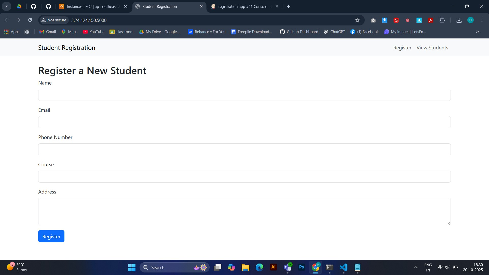
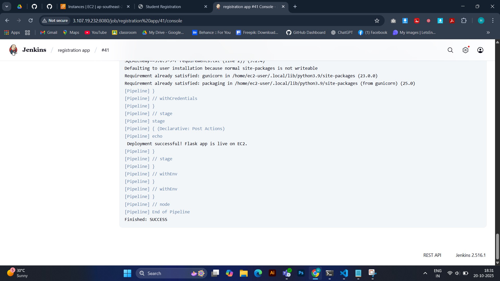
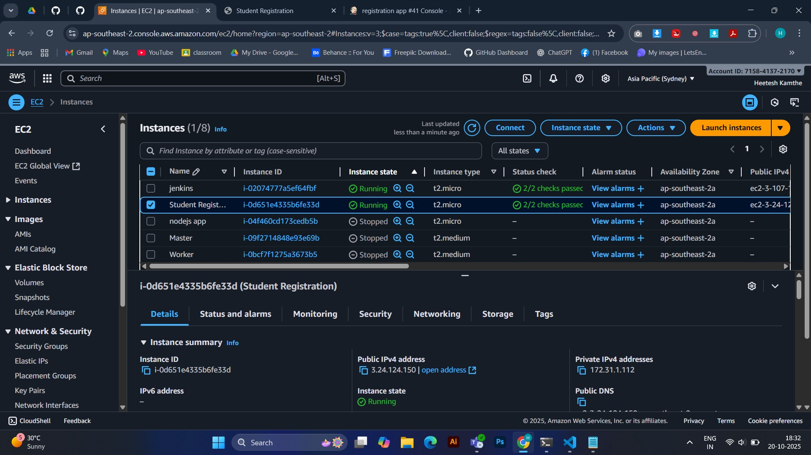
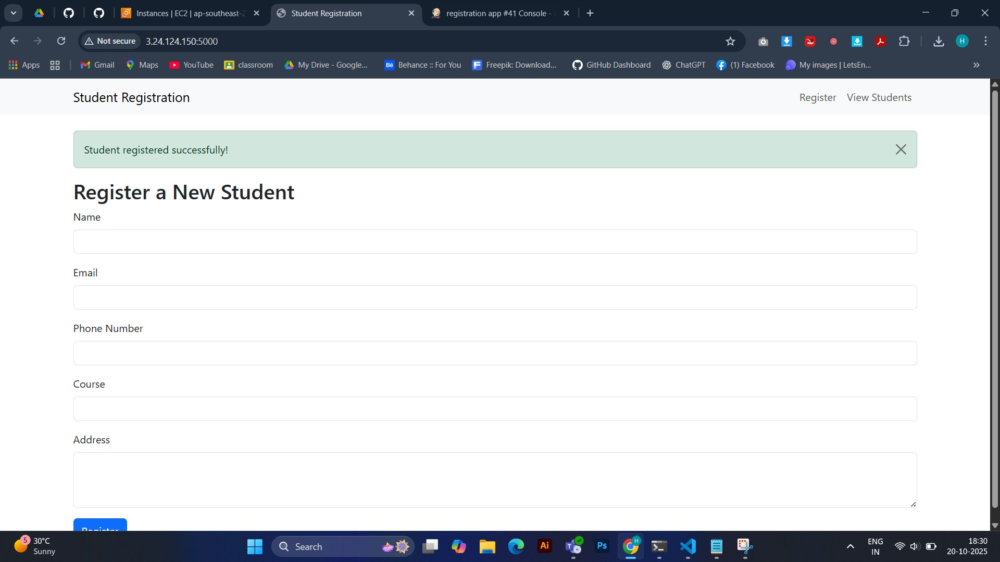
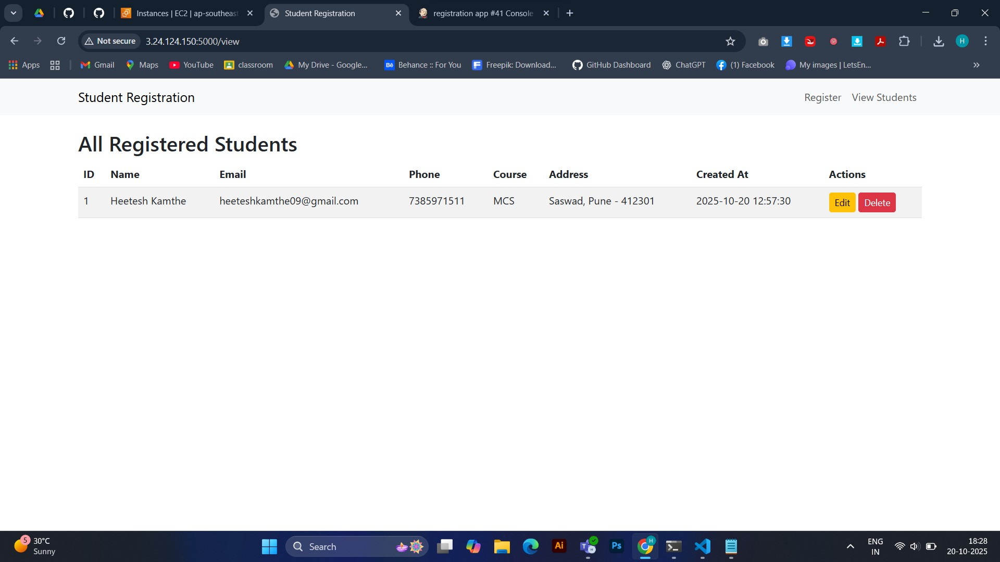

# 🧑🏻‍🎓 Student Registration Flask App

A **Flask-based Student Registration Web Application** with a **fully automated Jenkins CI/CD pipeline** that installs dependencies, configures a MariaDB database on an EC2 instance, and deploys the app via Gunicorn.

---

## 🚀 Overview

This project demonstrates:

* Building a Python Flask web app for student registration
* Creating and configuring a **MariaDB database** dynamically via Jenkins
* **Automated deployment** of the Flask app to an **EC2 instance** using SSH and credentials
* Continuous Integration stages including testing and dependency setup

---

## 🧬 Tech Stack

| Component       | Technology Used                       |
| --------------- | ------------------------------------- |
| **Backend**     | Python (Flask Framework)              |
| **Database**    | MariaDB (Auto-configured via Jenkins) |
| **Frontend**    | HTML, CSS (Flask Jinja templates)     |
| **Server**      | Gunicorn (on EC2)                     |
| **CI/CD**       | Jenkins Pipeline                      |
| **OS (Target)** | Amazon Linux 2 / Ubuntu EC2 Instance  |

---

## 📂 Repository Structure

```
stud-reg-flask-app-master/
│
├── app.py                # Main Flask application
├── run.py                # Entry point for running the app
├── config.py             # Configuration for database and app settings
├── models.py             # Database models
├── init.sql              # Database initialization script
├── requirements.txt      # Dependencies list
├── Jenkinsfile           # Jenkins CI/CD pipeline definition
└── templates/            # HTML templates (UI)
```

---

## ⚙️ Features

✅ Register new students
✅ View all registered students
✅ Edit or delete student records
✅ Uses MariaDB as backend database
✅ Jenkins pipeline for continuous integration & deployment
✅ Auto-creates database, tables, and user on EC2
✅ Serves app via Gunicorn

---

## 🧪 Prerequisites

* **Python 3.8+**
* **Jenkins (latest LTS)**
* **Git**
* **AWS EC2 Instance (Amazon Linux / Ubuntu)**
* **Jenkins Plugins:**

  * Git Plugin
  * Pipeline Plugin
  * SSH Agent Plugin
  * Credentials Binding Plugin

---

## 🖥️ Local Development Setup

1. **Clone Repository**

   ```bash
   git clone https://github.com/HeeteshKamthe/stud-reg-flask-app-master.git
   cd stud-reg-flask-app-master
   ```

2. **Install Python & Pip**

   ```bash
   sudo yum install python3 -y
   sudo yum install python3-pip -y
   ```

2. **Create Virtual Environment**

   ```bash
   python3 -m venv venv
   source venv/bin/activate      # On Windows: venv\Scripts\activate
   ```

3. **Install Dependencies**

   ```bash
   pip install -r requirements.txt
   pip install gunicorn
   ```

4. **Initialize Database (optional local use)**

   ```bash
   mysql -u root -p < init.sql
   ```

5. **Run Application**

   ```bash
   gunicorn run:app --bind 0.0.0.0:5000
   ```

   Open [http://<your_ip>:5000](http:/<your_ip>:5000)

---

## 🤖 Jenkins Pipeline Overview

Your **Jenkinsfile** defines an automated CI/CD pipeline with these stages:

| Stage                    | Description                                                                  |
| ------------------------ | ---------------------------------------------------------------------------- |
| **Checkout Code**        | Clones the latest code from GitHub                                           |
| **Install Dependencies** | Sets up Python venv, installs pip packages                                   |
| **Run Tests**            | Runs unit tests if present under `/tests`                                    |
| **Setup Database**       | Installs MariaDB on EC2, creates DB, user, and `students` table              |
| **Deploy to EC2**        | Copies files to EC2 via SCP, installs dependencies, starts app with Gunicorn |

---

## 🔑 Environment Variables & Credentials Used

| Variable                            | Purpose                                        | Source                       |
| ----------------------------------- | ---------------------------------------------- | ---------------------------- |
| `PYTHON`                            | Python executable (python3)                    | Defined in Jenkinsfile       |
| `DB_USER`, `DB_PASSWORD`, `DB_NAME` | Database credentials for MariaDB               | Defined in Jenkinsfile       |
| `ec2-ssh-key`                       | SSH private key to connect to EC2              | Jenkins Credential (SSH key) |
| `ec2-host`                          | EC2 public IP or DNS name                      | Jenkins Credential (string)  |
| `app-dir`                           | Remote directory path on EC2 to deploy the app | Jenkins Credential (string)  |

---

## 🛠️ Jenkins Configuration Guide

### 1. **Add Required Credentials in Jenkins**

Go to **Manage Jenkins → Credentials → Global → Add Credentials**
Create the following entries:

| ID            | Type                          | Example Value                                    |
| ------------- | ----------------------------- | ------------------------------------------------ |
| `ec2-ssh-key` | SSH Username with private key | Key for connecting to EC2 (`ec2-user`)           |
| `ec2-host`    | Secret text / String          | e.g., `13.232.45.10`                             |
| `app-dir`     | Secret text / String          | e.g., `/home/ec2-user/stud-reg-flask-app-master` |

---

### 2. **Create a Jenkins Pipeline Job**

1. In Jenkins Dashboard → **New Item → Pipeline**
2. Name: `Flask Student Registration Deployment`
3. Select: **Pipeline from SCM**
4. SCM: `Git`
5. Repository URL:

   ```
   https://github.com/HeeteshKamthe/stud-reg-flask-app-master.git
   ```
6. Branch: `main` or `master`
7. Script Path: `Jenkinsfile`
8. Save and Build the Job ✅

---

### 3. **What Happens When You Build**

Jenkins will:

1. Clone the repository
2. Install dependencies in a Python virtual environment
3. Connect to EC2 using SSH key credentials
4. Install MariaDB and create `student_db`
5. Transfer Flask project files to EC2
6. Install Gunicorn and start the app on port **5000**

---

### 4. **Verify Deployment**

SSH into your EC2 instance:

```bash
ssh -i your-key.pem ec2-user@<EC2_PUBLIC_IP>
```

Check Gunicorn process:

```bash
ps aux | grep gunicorn
```

Visit in browser:

```
http://<EC2_PUBLIC_IP>:5000
```

---

## 🧠 Example Jenkinsfile Snippet

```groovy
stage('Deploy to EC2') {
    steps {
        echo "🔹 Deploying Flask app to EC2 securely..."
        withCredentials([
            sshUserPrivateKey(credentialsId: 'ec2-ssh-key', keyFileVariable: 'KEY_PATH', usernameVariable: 'SSH_USER'),
            string(credentialsId: 'ec2-host', variable: 'EC2_HOST'),
            string(credentialsId: 'app-dir', variable: 'APP_DIR')
        ]) {
            sh '''
                scp -i "$KEY_PATH" -o StrictHostKeyChecking=no -r Jenkinsfile app.py config.py init.sql models.py requirements.txt run.py templates venv \
                ${SSH_USER}@${EC2_HOST}:${APP_DIR}/
                ssh -i "$KEY_PATH" ${SSH_USER}@${EC2_HOST} "
                    cd ${APP_DIR} &&
                    source venv/bin/activate &&
                    pip install -r requirements.txt &&
                    pip install gunicorn &&
                    pkill gunicorn || true &&
                    nohup gunicorn run:app --bind 0.0.0.0:5000 --daemon
                "
            '''
        }
    }
}
```

---

## 🧠 Troubleshooting

| Issue                           | Fix                                                                               |
| ------------------------------- | --------------------------------------------------------------------------------- |
| `ERROR 1064 (42000)`            | Use correct SQL syntax and ensure password quotes are correct in Jenkins DB setup |
| `ModuleNotFoundError`           | Reinstall dependencies after activating venv                                      |
| `Permission denied (publickey)` | Check Jenkins credentials and SSH key permissions                                 |
| `Port 5000 already in use`      | Run `pkill gunicorn` before redeployment                                          |

---

## 🖼️ Screenshot's

1. **Project Overview**
   <p align="center">  </p>
   
3. **Jenkins Configuration**
   <p align="center">  </p>
   
5. **Jenkins Build Console Output**
   <p align="center">  </p>
   
7. **EC2 Running App**
   <p align="center">  </p>
   
9. **Registration Success Page**
    <p align="center">  </p>
    
11. **Studnet List Page with Delete and Update Option's**
    <p align="center">  </p>
    

---
## 📜 License

This project is for **educational and learning purposes**.
Feel free to clone and modify it for personal or academic use.

---

## 👤 Author

**Heetesh Kamthe**
📦 [GitHub Repository](https://github.com/HeeteshKamthe/stud-reg-flask-app-master)

---
